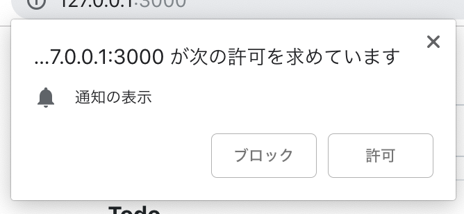
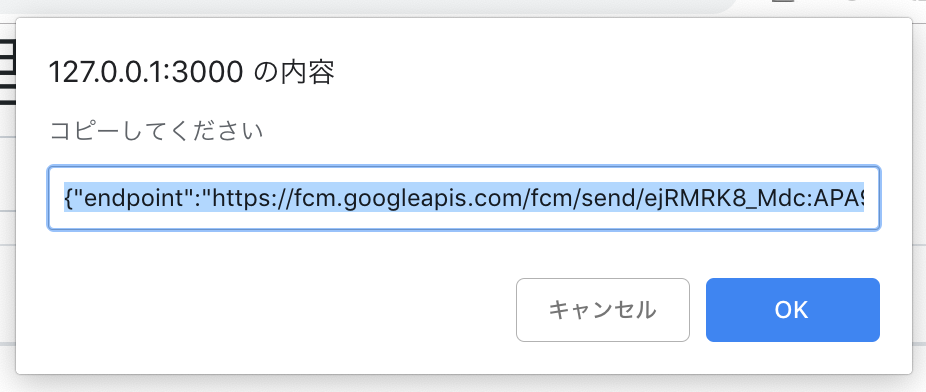
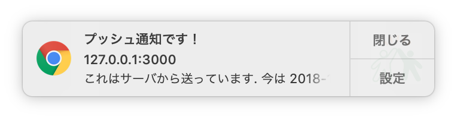

# 第7章 Webリモートプッシュ通知を実装する

WebリモートプッシュはWebブラウザベンダーにロックインされたものと、そうでないVAPIDがあります。簡単に比較すると次のようになります。

|     | Google Chrome | Firefox & Edge | iOS Safari | macOS Safari |
|-----------|---------------|----------------|------------|--------------|
|ベンダー実装|     ○         | ×              |×           | ○           |
|VAPID       |     ○         | ○              | ×          | ×           |

iOSはいずれのWebリモートプッシュ通知にも対応していません。iOS13以降に期待になるでしょう。macOS SafariではSafari Developerとして登録して証明書を作成する必要があります。そうした手間を考えると、現状ではVAPIDプッシュ通知だけ対応しておけば十分でしょう。以下の操作はデスクトップのGoogle ChromeやFirefox、EdgeそしてAndroidのGoogle Chromeだけが利用できます。

## ライブラリについて

Node.jsでWebPushを行う場合には `web-push` を使います。このライブラリはあらかじめインストールされています。

### 注意

MonacaのProプラン以上でないとターミナルが使えません。その場合はリポジトリをダウンロードまたはクローンの上、 `npm install` を行ってローカルでセットアップしてください。

https://github.com/hifivemania/pwa_handson

```
git clone git@github.com:hifivemania/pwa_handson.git
cd pwa_handson
npm install
```

## 鍵の生成

プッシュ通知は公開鍵/非公開鍵を用いて行います。そのための鍵を生成する処理は以下のコマンドを実行します。

```
npm run keygen
```

これは keygen.js を実行しています。keygen.jsはVAPID用のキーを生成して、 `application-server-keys.json` というファイルを作成します。

## JavaScriptの修正

Webブラウザで読み込んでいた app.js を app.push.js に変更します（index.html内の記述）。これはWebPushに関する記述がすでにされています。内容についてはコメントを参考にしてください。

```html
<script src="js/app.js"></script>
　↓
<script src="js/app.push.js"></script>
```

処理としては以下のようになっています。

- Service Workerのインストール
- プッシュ通知のサポート状況確認
- プッシュ通知が拒否されていないか確認
- 購読情報の取得
- 購読データの作成

## app.push.jsの修正

application-server-key.jsonに書かれている `publicKey` の値を app.push.js の KEY の値に置き換えてください。例えば `application-server-key.json` の内容が以下であったとします。

```json
{
  "publicKey": "BLr...bG-Gc",
  "privateKey":"di..5E"
}
```

この場合、 `BLr...bG-Gc` をコピーします。そして `app.push.js` を開きます。その中で下記の記載を探します。

```js
// KEYを生成した公開鍵に書き換えます
const key = 'KEY';
```

この key の値を書き換えます。今回の例では以下のようになります。

```js
// KEYを生成した公開鍵に書き換えます
const key = 'BLr...bG-Gc';
```

## Service Workerで必要な記述（記述済み）

WebPush通知を受け取るとService Worker `sw.js` の `push` イベントが呼ばれます。WebPushではペイロード（独自データ）が送信できます。そして `self.registration.showNotification` でプッシュ通知を表示します。sw.js内に以下の処理を追加します。これは受け取ったWebプッシュ通知の内容を表示する処理です。

```js
// 以下は記述済みです
// Webプッシュ通知の処理（第7章）
self.addEventListener('push', ev => {
  // payloadの取得
  const {title, msg, icon} = ev.data.json();
  self.registration.showNotification(title, {
    icon: icon,
    body: msg
  });
});
```

## HTMLを読み込む

Webページをリロードするとプッシュ通知の購読確認が表示されますので、購読を開始してください。



そうすると購読データが表示されますので、これをクリップボードにコピーしてください（一度目はnullが出ますので再読込してください）。通常、このデータをデータベースに保存します。



## プッシュ通知を送信する

先ほどコピーした内容を `token.json` として保存してください。場所は server.js または Monacaプロジェクトのトップディレクトリです。例えば以下のようにターミナルで入力するか、ローカルで作成したファイルをアップロードしてください。

```
touch token.json
// Monaca IDEのファイル一覧を更新して、token.jsonを更新する
```

保存したら以下のコマンドを実行します。

```
npm run push
```

うまくいけばプッシュ通知が表示されるはずです。このコマンドは push.js を実行しています。



ここまでの処理でWebPush通知の実装は完了です。

----

PWAを体験するハンズオンは以上で終了となります。

- アプリ化
- オフライン化
- Webプッシュ通知

の3つを体験してもらいました。他にも認証を容易にするWebAuthnであったり、決済を容易にするPayment Requestなどもあります。より使いやすいWebページのためにPWAを導入していきましょう。
